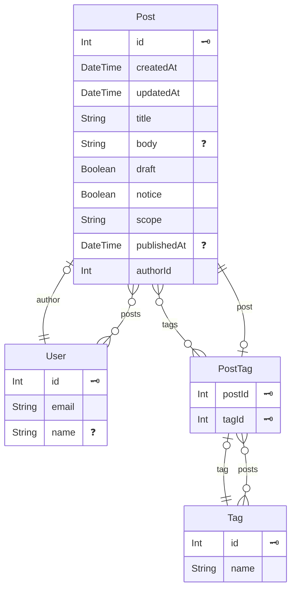

```mermaid
erDiagram

  "Post" {
    Int id "🗝️"
    DateTime createdAt 
    DateTime updatedAt 
    String title 
    String body "❓"
    Boolean draft 
    Boolean notice 
    String scope 
    DateTime publishedAt "❓"
    Int authorId 
    }
  

  "User" {
    Int id "🗝️"
    String email 
    String name "❓"
    }
  

  "Tag" {
    Int id "🗝️"
    String name 
    }
  

  "PostTag" {
    Int postId "🗝️"
    Int tagId "🗝️"
    }
  
    "Post" o|--|| "User" : "author"
    "Post" o{--}o "PostTag" : "tags"
    "User" o{--}o "Post" : "posts"
    "Tag" o{--}o "PostTag" : "posts"
    "PostTag" o|--|| "Post" : "post"
    "PostTag" o|--|| "Tag" : "tag"
```
